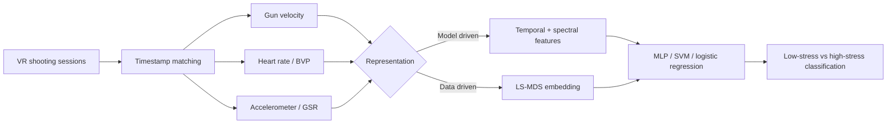

# Instantaneous Stress Detection with Machine Learning and MDS

An exploratory study of sub-10-second stress classification from physiological and physical sensor streams collected during a virtual-reality shooting simulation.

The project compares two strategies:

1. A model-driven pipeline that extracts temporal and spectral features before classification
2. A data-driven least-squares multidimensional scaling (LS-MDS) pipeline that reduces dimensionality before classification

The central question is practical: Can subject stress be identified quickly enough for an online system without giving up too much accuracy?

> This repository reorganizes an academic project by Saad Rahman at the University of Maryland, Baltimore County. The notebooks and HDF5 files are historical research artifacts and have not been rewritten.

## Key result

For the best case reported on subject 28, the classical pipeline reached **89.58% accuracy** with **7.08 seconds** of classification time. LS-MDS with 30 components reached **84.31% accuracy** in **1.16 seconds**. Across the four analyzed subjects, the report describes MDS classification as **83.61% faster** on average with a **5.27 percentage-point accuracy reduction**.

| Approach | Configuration | Accuracy | Classification time | Preprocessing time |
| --- | --- | ---: | ---: | ---: |
| Engineered features + MLP | 50 reported features | 89.58% | 7.08 s | 62.73 s feature extraction |
| LS-MDS + MLP | 30 components | 84.31% | 1.16 s | 48.66 s scaling |

The timings and accuracies are the authors' historical results. Random train/test splits and neural-network initialization were not seeded in the retained notebook, so a rerun can differ.

## Data pipeline



The original study collected 17 subjects, but only four complete subject datasets are present here: 21, 28, 29, and 31. Each retained HDF5 file contains six sessions organized by sensor channel.

## Repository layout

```text
.
├── data/
│   ├── README.md
│   └── subject-{21,28,29,31}.h5       # Local de-identified feature datasets
├── docs/
│   ├── proposal.pdf
│   └── final-report.pdf
├── notebooks/
│   ├── feature-extraction.ipynb       # Raw-session alignment and HDF5 creation
│   └── classification-and-mds.ipynb  # Features, classifiers, MDS, and plots
└── requirements.txt
```

## Data-release safeguard

The HDF5 files contain measurements derived from human-participant sessions. They are copied into this local repository for reproducibility but are ignored by Git by default. **Do not force-add or publish them until the applicable consent, IRB, lab, and institutional data-sharing rules have been confirmed.**

This protection means a normal GitHub Desktop commit will include `data/README.md`, not the `.h5` files.

## Environment

Create an isolated Python environment and install the public dependencies:

```bash
python -m venv .venv

# Windows PowerShell
.venv\Scripts\Activate.ps1

python -m pip install -r requirements.txt
jupyter lab
```

The feature-extraction notebook also imports two lab-specific modules, `xdf` and `psyphyea`, and expects raw session files beneath `/mnt/neurodata/NeurofeedbackStudy/data/processed/`. Those dependencies and raw files were not included in the course archive.

The classification notebook imports the same lab modules even though its included-HDF5 workflow does not use them directly. In an environment without those modules, comment out those two imports before running only the classification sections.

## Workflow

### 1. Feature extraction

Open `notebooks/feature-extraction.ipynb` when the original lab data and helper modules are available. The notebook:

- Identifies the six shooting sessions for a subject.
- Aligns sensor samples to target appearance/disappearance timestamps.
- Derives gun velocity.
- Extracts Empatica accelerometer, blood-volume pulse, heart-rate, skin-conductance, and temperature windows.
- Writes a subject-level HDF5 file.

The absolute lab path and subject ID are configured directly in notebook cells.

### 2. Classification and MDS

Open `notebooks/classification-and-mds.ipynb` from the repository root so the relative HDF5 filenames resolve. The notebook includes:

- Accelerometer feature extraction.
- Normalization.
- Multilayer perceptron and support-vector-machine classifiers.
- A Keras single-output model used as logistic regression.
- A scikit-learn MDS experiments.
- Accuracy and execution-time plots for subjects 21, 28, 29, and 31.

The report evaluates five sensor combinations and MDS embeddings from 10 through 50 components. The best reported MDS setting used 30 components.

## Historical limitations

- The notebooks are exploratory rather than packaged production code.
- File paths, subject IDs, session counts, and test-set sizes are configured in cells.
- Train/test splits do not set `random_state`.
- The report's feature-count terminology and the retained notebook implementation are not perfectly aligned; use the report for the published results and the notebook as the executable research record.
- Modern TensorFlow/Keras releases may require small API updates to the historical model cells.
- No claim is made that the model generalizes beyond the four retained complete subjects.

## Documentation

- [Project proposal](docs/proposal.pdf)
- [Final report](docs/final-report.pdf)
- [Dataset notes](data/README.md)

## License and responsible use

No software or data license was included with the original materials.
